# ESQUEMÁTICO DE CONEXIONES: ARDUINO MKR 1310 (ROVER LUNAR V2.0)

> **Documentación de Hardware y Cableado Físico para la Electrónica de a Bordo**  
> Este documento detalla la distribución de pines, conexionado de actuadores, módulo de radiofrecuencia, buses de potencia y precauciones críticas para el microcontrolador **Arduino MKR 1310** en la arquitectura Rocker-Bogie 6x6 con 4 servomotores de dirección independientes.

---

## 1. Diagrama Físico de Pines del Arduino MKR 1310

El Arduino MKR 1310 cuenta con dos hileras de 14 pines con lógica nativa de **3.3V** (SAMD21 ARM Cortex-M0+).

```text
                       ARDUINO MKR 1310
                         +-----------+
                         |  [USB]    |
         (AREF) [  ]     |           |     [  ] (VCC 3.3V)
      (DAC0/A0) [  ]     |           |     [  ] (5V OUT / USB)
    (Servo 3) A1 [  ]     |           |     [  ] (VIN / BATT IN)
    (Servo 4) A2 [  ]     |           |     [  ] (GND) -----------> MASA COMÚN
          (A3)  [  ]     |           |     [  ] (RESET)
          (A4)  [  ]     |           |     [  ] (TX / 14)
          (A5)  [  ]     |           |     [  ] (RX / 13)
          (A6)  [  ]     |           |     [  ] (SCL / 12)
    (RF24 CE) 0 [  ]     |           |     [  ] (SDA / 11)
   (RF24 CSN) 1 [  ]     |           |     [  ] (MISO / 10) <---- (RF24 MISO)
  (L9110S A1A) 2 [  ]     |           |     [  ] (SCK / 9)   ----> (RF24 SCK)
  (L9110S B1A) 3 [  ]     |           |     [  ] (MOSI / 8)  ----> (RF24 MOSI)
  (L9110S B1B) 4 [  ]     |           |     [  ] (7 / PWM)   ----> (Servo 2 S2)
  (L9110S A1B) 5 [  ]     |           |     [  ] (6 / PWM)   ----> (Servo 1 S1)
                         +-----------+
```

---

## 2. Diagrama de Bloques de Arquitectura (Mermaid)

```mermaid
graph TD
    subgraph ALIMENTACION ["Sistema de Energía"]
        BATT["Batería LiPo 7.4V - 8.4V"]
        STEPDOWN["Regulador Step-Down Buck (5V - 6V)"]
        BATT -->|"Alimentación Primaria"| STEPDOWN
        BATT -->|"Línea Potencia Motores"| L9110S_VCC["VCC Motor Puente H L9110S"]
        BATT -->|"VIN / 5V"| MKR_VIN["VIN Arduino MKR 1310"]
    end

    subgraph LOGICA_MKR ["Arduino MKR 1310 (3.3V Lógica)"]
        MKR_3V3["Salida 3.3V Regulada"]
        GND["GND (Tierra Común del Sistema)"]
        
        P_D0["Pin Digital 0 (CE)"]
        P_D1["Pin Digital 1 (CSN)"]
        P_SPI["Pines 8, 9, 10 (SPI HW)"]
        
        P_D2["Pin Digital 2 (PWM)"]
        P_D5["Pin Digital 5 (PWM)"]
        P_D3["Pin Digital 3 (PWM)"]
        P_D4["Pin Digital 4 (PWM)"]
        
        P_D6["Pin Digital 6 (PWM)"]
        P_D7["Pin Digital 7 (PWM)"]
        P_A1["Pin A1 (PWM)"]
        P_A2["Pin A2 (PWM)"]
    end

    subgraph RADIO ["Módulo Transceptor RF"]
        NRF["NRF24L01+ (Canal 108, 250 kbps)"]
        CAP["Capacitor Electrolítico 10-100µF"]
        MKR_3V3 --> NRF
        CAP --- NRF
        P_D0 --> NRF
        P_D1 --> NRF
        P_SPI --> NRF
    end

    subgraph TRACCION ["Etapa de Potencia de Tracción"]
        L9110S["Puente H Dual L9110S"]
        P_D2 -->|"A1A: Izquierda Avance"| L9110S
        P_D5 -->|"A1B: Izquierda Reversa"| L9110S
        P_D3 -->|"B1A: Derecha Avance"| L9110S
        P_D4 -->|"B1B: Derecha Reversa"| L9110S
        
        MOT_IZQ["Motores Lado Izquierdo (M1, M2, M3)"]
        MOT_DER["Motores Lado Derecho (M4, M5, M6)"]
        
        L9110S --> MOT_IZQ
        L9110S --> MOT_DER
    end

    subgraph DIRECCION ["Etapa de Servos de Dirección"]
        S1["Servo S1 (Delantero Izq)"]
        S2["Servo S2 (Delantero Der)"]
        S3["Servo S3 (Trasero Izq)"]
        S4["Servo S4 (Trasero Der)"]
        
        STEPDOWN -->|"Línea Aislada 5V-6V"| S1
        STEPDOWN -->|"Línea Aislada 5V-6V"| S2
        STEPDOWN -->|"Línea Aislada 5V-6V"| S3
        STEPDOWN -->|"Línea Aislada 5V-6V"| S4
        
        P_D6 -->|"Señal PWM"| S1
        P_D7 -->|"Señal PWM"| S2
        P_A1 -->|"Señal PWM"| S3
        P_A2 -->|"Señal PWM"| S4
    end

    GND --- STEPDOWN
    GND --- NRF
    GND --- L9110S
    GND --- S1
    GND --- S2
    GND --- S3
    GND --- S4
```



---

## 3. Tablas Detalladas de Conexionado Pin a Pin

### 3.1. Módulo de Radiofrecuencia NRF24L01+

| Pin NRF24L01 | Pin MKR 1310 | Nivel de Voltaje | Detalle y Observaciones Críticas |
|---|---|---|---|
| **VCC** | **VCC (3.3V)** | **3.3V DC** | **¡PELIGRO!** Conectar a 5V destruye la radio inmediatamente. Debe llevar un capacitor de 10µF a 100µF soldado en paralelo entre VCC y GND. |
| **GND** | **GND** | 0V | Conectado a la tierra común del sistema. |
| **CE** | **Pin Digital 0** | 3.3V (Salida) | Chip Enable: Habilita el modo RX/TX de la radio. |
| **CSN** | **Pin Digital 1** | 3.3V (Salida) | Chip Select Not: Control SPI de bus de radio. |
| **SCK** | **Pin Digital 9** | 3.3V (Salida) | Bus SPI Hardware (Clock). Fijo por arquitectura SAMD21. |
| **MOSI** | **Pin Digital 8** | 3.3V (Salida) | Bus SPI Hardware (Master Out Slave In). |
| **MISO** | **Pin Digital 10**| 3.3V (Entrada) | Bus SPI Hardware (Master In Slave Out). |
| **IRQ** | *No conectado* | - | Interrupción por hardware opcional (no requerida en este firmware). |

---

### 3.2. Controlador de Motores: Puente H Dual L9110S (HG7881)

| Pin L9110S | Pin MKR 1310 | Función de Tracción | Comportamiento Lógico |
|---|---|---|---|
| **A1A** | **Pin Digital 2** | Motor Izquierdo — Avance | PWM (0 - 255). Se activa cuando `pwmIzq > 0`. |
| **A1B** | **Pin Digital 5** | Motor Izquierdo — Reversa | PWM (0 - 255). Se activa cuando `pwmIzq < 0`. *(Nota: físicamente cruzado con Pin 5 para sentido correcto)* |
| **B1A** | **Pin Digital 3** | Motor Derecho — Avance | PWM (0 - 255). Se activa cuando `pwmDer > 0`. |
| **B1B** | **Pin Digital 4** | Motor Derecho — Reversa | PWM (0 - 255). Se activa cuando `pwmDer < 0`. |
| **VCC** | **Batería (+) / Step-Down** | Alimentación de Potencia | Alimentación de armadura de motores DC (5V a 8.4V según caja reductora). |
| **GND** | **GND Común** | Retorno de Potencia | Conectado directamente a la masa del Arduino MKR. |
| **MOTOR A**| Bornera a Motores Izq | Tracción M1, M2, M3 | Bornes en paralelo a los motores del lado izquierdo. |
| **MOTOR B**| Bornera a Motores Der | Tracción M4, M5, M6 | Bornes en paralelo a los motores del lado derecho. |

> [!NOTE]
> **Por qué se usan los pines 0 y 1 para la radio:**  
> Originalmente la radio ocupaba los pines 4 y 5. Al necesitar 4 señales PWM independientes y bidireccionales para el puente H L9110S, se liberaron los pines 2, 3, 4 y 5 reubicando CE y CSN a los pines 0 y 1.

---

### 3.3. Servomotores de Dirección (S1, S2, S3, S4)

| Servomotor | Ubicación Física | Pin MKR 1310 (Señal) | Pin VCC (Alimentación) | Pin GND (Tierra) |
|---|---|---|---|---|
| **Servo S1** | Delantero Izquierdo | **Pin Digital 6** (PWM) | **Salida 5V/6V Step-Down** | GND Común |
| **Servo S2** | Delantero Derecho   | **Pin Digital 7** (PWM) | **Salida 5V/6V Step-Down** | GND Común |
| **Servo S3** | Trasero Izquierdo   | **Pin A1** (Digital PWM)| **Salida 5V/6V Step-Down** | GND Común |
| **Servo S4** | Trasero Derecho     | **Pin A2** (Digital PWM)| **Salida 5V/6V Step-Down** | GND Común |

> [!CAUTION]
> **REGLA DE VIDA O MUERTE PARA SERVOMOTORES:**  
> 1. **NUNCA alimentar los servomotores desde el pin 3.3V ni 5V del Arduino MKR**: Los picos de corriente inductiva (>1A bajo carga) queman el regulador interno del MKR o provocan reinicios constantes (Brown-Out).  
> 2. **NUNCA alimentar con reguladores lineales tipo 7805**: Disipan calor extremo (>80°C) y pueden sufrir fuga térmica. Usar siempre **Step-Down conmutado (Buck)**.  
> 3. **Límites de carrera por software**: Rango seguro estricto de **10° a 170°** (Centro = 90°).

---

## 4. Distribución de Potencia y Punto Estrella de Masa (GND)

Para evitar que el ruido inductivo de los motores amarillos y los servos corrompa los paquetes de la radio o cuelgue el microcontrolador:

1. **Punto Común de Masa (Star Ground):**
   * El polo negativo de la batería debe llegar a una regleta de masa común.
   * De esa regleta se derivan cables directos e individuales hacia:
     1. Pin GND del Arduino MKR 1310.
     2. GND del Puente H L9110S.
     3. Salida GND (OUT-) del regulador Step-Down.
     4. Cable de masa de los 4 Servomotores.
2. **Capacitor de Desacople en NRF24L01+:**
   * Capacitor de **47µF o 100µF x 16V** soldado lo más cerca posible de las patitas VCC y GND del módulo de radio.
3. **Capacitores de Supresión en Motores DC:**
   * Se recomienda soldar un capacitor cerámico de 100nF (código 104) entre los dos bornes de cada motor amarillo para mitigar chispas en las escobillas.

---

## 5. Resumen de Pines Ocupados vs Libres en MKR 1310

| Pin MKR 1310 | Estado | Función Asignada |
|---|---|---|
| **AREF** | Libre | Referencia analógica |
| **DAC0 / A0** | Libre | Reservado para sensor analógico futuro (Gas / Shunt) |
| **A1** | **OCUPADO** | Señal PWM Servo S3 (Trasero Izquierdo) |
| **A2** | **OCUPADO** | Señal PWM Servo S4 (Trasero Derecho) |
| **A3** | Libre | Disponible para sensores |
| **A4** | Libre | Disponible para sensores |
| **A5** | Libre | Disponible para sensores |
| **A6** | Libre | Disponible para telemetría de batería (Divisor resistivo) |
| **D0** | **OCUPADO** | NRF24L01+ CE |
| **D1** | **OCUPADO** | NRF24L01+ CSN |
| **D2** | **OCUPADO** | L9110S A1A (Avance Izquierdo PWM) |
| **D3** | **OCUPADO** | L9110S B1A (Avance Derecho PWM) |
| **D4** | **OCUPADO** | L9110S B1B (Reversa Derecho PWM) |
| **D5** | **OCUPADO** | L9110S A1B (Reversa Izquierdo PWM) |
| **D6** | **OCUPADO** | Señal PWM Servo S1 (Delantero Izquierdo) |
| **D7** | **OCUPADO** | Señal PWM Servo S2 (Delantero Derecho) |
| **D8** | **OCUPADO** | NRF24L01+ MOSI (SPI) |
| **D9** | **OCUPADO** | NRF24L01+ SCK (SPI) |
| **D10** | **OCUPADO** | NRF24L01+ MISO (SPI) |
| **D11 (SDA)** | Libre | Bus I2C Datos (Disponible para IMU MPU6050 / BME280) |
| **D12 (SCL)** | Libre | Bus I2C Reloj (Disponible para IMU MPU6050 / BME280) |
| **D13 (RX)** | Libre | Puerto Serial UART Hardware disponible |
| **D14 (TX)** | Libre | Puerto Serial UART Hardware disponible |
