# ESQUEMÁTICO DE CONEXIONES: ARDUINO NANO ESP32 (ROVER LUNAR V2.0)

> **Documentación de Hardware y Cableado Físico para la Electrónica de a Bordo**  
> Este documento detalla la distribución de pines, conexionado de actuadores, módulo de radiofrecuencia, buses de potencia, diferencias de conexionado respecto al Arduino MKR 1310 y la **lista de pines libres disponibles para futuras expansiones** en la arquitectura Rocker-Bogie 6x6 con 4 servomotores independientes.

---

## 1. Comparativa de Pines: Arduino MKR 1310 vs. Arduino Nano ESP32

El paso de la placa **Arduino MKR 1310** (SAMD21) al **Arduino Nano ESP32** (ESP32-S3) mantiene la lógica segura a **3.3V** pero simplifica el cableado y libera múltiples pines gracias a la versatilidad de la matriz de pines del ESP32:

| Función del Sistema | Pin en Arduino MKR 1310 | Pin en Arduino Nano ESP32 | Observación / Tipo de Señal |
|---|---|---|---|
| **NRF24L01+ CE** | Pin Digital 0 | **Pin Digital D9** (GPIO 18) | Salida Digital (Habilitación de Radio) |
| **NRF24L01+ CSN** | Pin Digital 1 | **Pin Digital D10** (GPIO 21) | Salida Digital (Chip Select SPI) |
| **NRF24L01+ MOSI** | Pin Digital 8 | **Pin Digital D11** (GPIO 38) | Bus SPI Hardware (Master Out) |
| **NRF24L01+ MISO** | Pin Digital 10 | **Pin Digital D12** (GPIO 47) | Bus SPI Hardware (Master In) |
| **NRF24L01+ SCK** | Pin Digital 9 | **Pin Digital D13** (GPIO 48) | Bus SPI Hardware (Clock) |
| **NRF24L01+ VCC** | Salida 3.3V | **Salida 3.3V** | Alimentación 3.3V (¡Nunca 5V!) + Capacitor 10–100µF |
| **L9110S Motor Izq Avance (A1A)** | Pin Digital 2 | **Pin Digital D2** (GPIO 4) | Salida PWM (Tracción Motores M1, M2, M3) |
| **L9110S Motor Izq Reversa (A1B)** | Pin Digital 5 | **Pin Digital D5** (GPIO 7) | Salida PWM (Tracción Motores M1, M2, M3) |
| **L9110S Motor Der Avance (B1A)** | Pin Digital 3 | **Pin Digital D3** (GPIO 5) | Salida PWM (Tracción Motores M4, M5, M6) |
| **L9110S Motor Der Reversa (B1B)** | Pin Digital 4 | **Pin Digital D4** (GPIO 6) | Salida PWM (Tracción Motores M4, M5, M6) |
| **Servo S1 (Delantero Izquierdo)** | Pin Digital 6 | **Pin Digital D6** (GPIO 8) | Salida Señal PWM / Servo 50 Hz |
| **Servo S2 (Delantero Derecho)** | Pin Digital 7 | **Pin Digital D7** (GPIO 9) | Salida Señal PWM / Servo 50 Hz |
| **Servo S3 (Trasero Izquierdo)** | Pin A1 (Pin 16) | **Pin Digital D8** (GPIO 17) | Salida Señal PWM / Servo 50 Hz (Pasa a Pin Digital directo) |
| **Servo S4 (Trasero Derecho)** | Pin A2 (Pin 17) | **Pin Analógico A0** (GPIO 1) | Salida Señal PWM / Servo 50 Hz |

---

## 2. Diagrama Físico de Pines (Pinout Arduino Nano ESP32)

El Arduino Nano ESP32 cuenta con dos hileras de 15 pines estándar. A continuación se presenta el mapa completo de asignaciones físicas:

```text
                               ARDUINO NANO ESP32
                                  +-----------+
                                  |   [USB]   |
               (RF24 SCK)  D13 [  ] |           | [  ] D12  (RF24 MISO)
             (RF24 VCC)   3.3V [  ] |           | [  ] D11  (RF24 MOSI)
              (DISPONIBLE) AREF [  ] |           | [  ] D10  (RF24 CSN)
              (Servo 4 S4)   A0 [  ] |           | [  ] D9   (RF24 CE)
       *LIBRE* (Sensor ADC)  A1 [  ] |           | [  ] D8   (Servo 3 S3)
       *LIBRE* (Sensor ADC)  A2 [  ] |           | [  ] D7   (Servo 2 S2)
       *LIBRE* (Sensor ADC)  A3 [  ] |           | [  ] D6   (Servo 1 S1)
        *LIBRE* (I2C SDA)   A4 [  ] |           | [  ] D5   (L9110S A1B - Izq Rev)
        *LIBRE* (I2C SCL)   A5 [  ] |           | [  ] D4   (L9110S B1B - Der Rev)
             *LIBRE* (ADC)  A6 [  ] |           | [  ] D3   (L9110S B1A - Der Av)
             *LIBRE* (ADC)  A7 [  ] |           | [  ] D2   (L9110S A1A - Izq Av)
                 (5V USB)  VBUS [  ] |           | [  ] GND  ------> MASA COMÚN
                               RST [  ] |           | [  ] RST
                 MASA COMÚN   GND [  ] |           | [  ] D0   (RX0 / *LIBRE UART*)
    (Entrada 6V-21V Batería)  VIN [  ] |           | [  ] D1   (TX0 / *LIBRE UART*)
                                  +-----------+
```

---

## 3. ¿Qué Pines Quedan Libres para Futuras Expansiones?

Una de las grandes ventajas de migrar al Arduino Nano ESP32 es la cantidad de pines de alto rendimiento que quedan totalmente desocupados:

| Pin Libre | Tipo de Pin / Capacidad Hardware | Aplicación Recomendada para el Rover |
|---|---|---|
| **A4 (SDA)** y **A5 (SCL)** | **Bus I2C Hardware Nativo** | **Sensor IMU / Giroscopio (MPU6050 o BNO055):** Esencial para medir en tiempo real el cabeceo (pitch), balanceo (roll) y advertir peligro de vuelco en la rampa a 20° de CEPIT. |
| **A1** | **Entrada Analógica ADC (12 bits)** | **Monitor de Batería LiPo:** Con un simple divisor resistivo (2 resistencias) permite medir el voltaje de la batería y transmitir el porcentaje restante por telemetría. |
| **A2** y **A3** | **Entradas/Salidas Digitales y ADC** | **Sensor Anticolisión:** Conexión de un sensor ultrasónico HC-SR04 o un sensor de distancia láser ToF (VL53L0X) para frenado automático ante obstáculos. |
| **D0 (RX)** y **D1 (TX)** | **Puerto Serie Hardware UART0** | **Enlace de Telemetría o Cámara:** Comunicación bidireccional de datos con el módulo ESP32-CAM, un módulo GPS de navegación o telemetría LoRa secundaria. |
| **A6** y **A7** | **Entradas Analógicas ADC adicionales** | **Sensores de Monitoreo Ambiental:** Detección de gases (MQ-2 / MQ-135) o temperatura para la misión industrial de inspección subterránea descrita en el proyecto. |
| **AREF** | Referencia de Voltaje Analógico | Referencia externa precisa si se requiere calibrar sensores analógicos de laboratorio. |

---

## 4. Diagrama de Bloques de Arquitectura (Mermaid)

```mermaid
graph TD
    subgraph ALIMENTACION ["Sistema de Energía y Buses de Potencia"]
        BATT["Batería LiPo 2S (7.4V - 8.4V)"]
        STEPDOWN["Regulador Step-Down Buck (5V - 6V / 3A)"]
        BATT -->|"Línea Primaria"| STEPDOWN
        BATT -->|"Alimentación Motores DC"| L9110S_VCC["VCC Motor Puente H L9110S"]
        BATT -->|"Entrada VIN (6V-21V)"| NANO_VIN["VIN Arduino Nano ESP32"]
        STEPDOWN -->|"Línea Aislada 5V-6V"| SERVO_VCC["VCC Servomotores S1, S2, S3, S4"]
    end

    subgraph LOGICA_NANO ["Arduino Nano ESP32 (Lógica Nativa 3.3V)"]
        NANO_3V3["Salida 3.3V Regulada"]
        GND["GND (Tierra Común del Chasis)"]
        
        P_D9["Pin D9 (CE)"]
        P_D10["Pin D10 (CSN)"]
        P_SPI["Pines D11, D12, D13 (Bus SPI)"]
        
        P_D2["Pin D2 (PWM A1A)"]
        P_D5["Pin D5 (PWM A1B)"]
        P_D3["Pin D3 (PWM B1A)"]
        P_D4["Pin D4 (PWM B1B)"]
        
        P_D6["Pin D6 (PWM S1)"]
        P_D7["Pin D7 (PWM S2)"]
        P_D8["Pin D8 (PWM S3)"]
        P_A0["Pin A0 (PWM S4)"]

        P_EXP["Pines Libres: A1-A7, D0, D1"]
    end

    subgraph RADIO ["Módulo de Comunicación Inalámbrica"]
        NRF["NRF24L01+ (Canal 108, 250 kbps)"]
        CAP["Capacitor Electrolítico 10–100 µF"]
        NANO_3V3 -->|"3.3V Estricto (¡Nunca 5V!)"| NRF
        GND --- NRF
        CAP ---|"Soldado directo en VCC y GND"| NRF
        P_D9 --> NRF
        P_D10 --> NRF
        P_SPI <--> NRF
    end

    subgraph TRACCION ["Actuadores de Tracción (6 Motores DC)"]
        HBRIDGE["Puente H L9110S"]
        MOT_IZQ["Motores Izquierda: M1, M2, M3"]
        MOT_DER["Motores Derecha: M4, M5, M6"]
        
        P_D2 -->|"Avance Izq (PWM)"| HBRIDGE
        P_D5 -->|"Reversa Izq (PWM)"| HBRIDGE
        P_D3 -->|"Avance Der (PWM)"| HBRIDGE
        P_D4 -->|"Reversa Der (PWM)"| HBRIDGE
        
        HBRIDGE --> MOT_IZQ
        HBRIDGE --> MOT_DER
    end

    subgraph DIRECCION ["Actuadores de Dirección (4 Servomotores)"]
        S1["Servo 1: Delantero Izquierdo"]
        S2["Servo 2: Delantero Derecho"]
        S3["Servo 3: Trasero Izquierdo"]
        S4["Servo 4: Trasero Derecho"]
        
        P_D6 -->|"Señal"| S1
        P_D7 -->|"Señal"| S2
        P_D8 -->|"Señal"| S3
        P_A0 -->|"Señal"| S4
    end

    subgraph SENSORES_FUTUROS ["Expansiones Planificadas (Pines Libres)"]
        IMU["Giroscopio / IMU MPU6050 (A4/A5 I2C)"]
        BAT_MON["Monitor de Batería LiPo (Pin A1)"]
        CAM_SERIAL["Enlace ESP32-CAM (Pines D0/D1 UART)"]
    end

    GND --- L9110S_VCC
    GND --- STEPDOWN
    GND --- SERVO_VCC
```



---

## 5. Tabla de Cableado Físico Detallado

### 5.1. Conexión del Módulo de Radiofrecuencia NRF24L01+
> [!CAUTION]
> **VCC debe alimentarse ÚNICAMENTE desde la salida de 3.3V del Arduino Nano ESP32.** Conectarlo a 5V quema la radio instantáneamente. Es obligatorio soldar un capacitor electrolítico de **10 µF a 100 µF** entre los pines VCC y GND de la plaquita de la radio.

| Pin del NRF24L01 | Pin en Arduino Nano ESP32 | Función |
|---|---|---|
| **VCC** | **3.3V** | Alimentación lógica regulada (3.3V) |
| **GND** | **GND** | Tierra común |
| **CE** | **Pin D9** | Chip Enable (Control de recepción/transmisión) |
| **CSN** | **Pin D10** | Chip Select Not (Habilitación SPI) |
| **SCK** | **Pin D13** | Reloj de bus SPI |
| **MOSI** | **Pin D11** | Master Out Slave In |
| **MISO** | **Pin D12** | Master In Slave Out |

---

### 5.2. Conexión del Puente H L9110S (Tracción 6x6)
* **VCC del Puente H:** Directo al positivo de la batería LiPo (7.4V - 8.4V).
* **GND del Puente H:** A la masa común (GND).

| Bornera / Pin L9110S | Pin en Arduino Nano ESP32 | Efecto en Motores |
|---|---|---|
| **A1A** | **Pin D2** | Tracción Izquierda - Sentido de Avance (PWM) |
| **A1B** | **Pin D5** | Tracción Izquierda - Sentido de Reversa (PWM) |
| **B1A** | **Pin D3** | Tracción Derecha - Sentido de Avance (PWM) |
| **B1B** | **Pin D4** | Tracción Derecha - Sentido de Reversa (PWM) |

---

### 5.3. Conexión de Servomotores de Dirección (4WS Rocker-Bogie)
> [!WARNING]
> **Alimentación aislada obligatoria:** El cable rojo (VCC) de los 4 servomotores se debe conectar a la salida de **5V o 6V del regulador Step-Down**. El cable negro o marrón va a GND común. La salida de 3.3V del Nano ESP32 no tiene suficiente corriente para alimentar servos y se reiniciará el microcontrolador si se intenta.

| Servomotor | Pin de Señal en Nano ESP32 | Posición Física en el Chasis |
|---|---|---|
| **Servo 1** | **Pin D6** | Rueda Delantera Izquierda |
| **Servo 2** | **Pin D7** | Rueda Delantera Derecha |
| **Servo 3** | **Pin D8** | Rueda Trasera Izquierda |
| **Servo 4** | **Pin A0** | Rueda Trasera Derecha |

---

## 6. Reglas de Seguridad en el Código y Pruebas
1. **Límites angulares en software:** El firmware en [`Ejecutor_ArduinoNano_ESP32.ino`](file:///mnt/c/Users/joaqu/Downloads/hmi_rover_cepit/Firmware_y_Control/Ejecutor/Ejecutor_ArduinoNano_ESP32/Ejecutor_ArduinoNano_ESP32.ino) aplica automáticamente `constrain(angulo, 10, 170)` para no forzar los engranajes plásticos de los servos.
2. **Watchdog de seguridad:** Si se interrumpe la señal de radio por más de 1 segundo (1000 ms), el rover frena sus 6 motores a 0 de forma preventiva.
3. **Masa común obligatoria:** La tierra (GND) del regulador Step-Down, de la batería LiPo, del puente H y del Arduino Nano ESP32 deben estar físicamente unidas para garantizar referencias de voltaje correctas.
