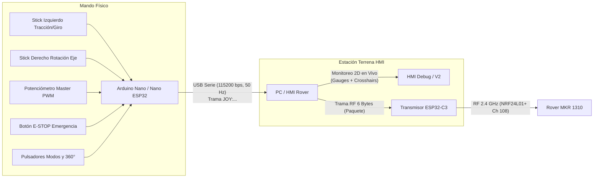

# GUÍA TÉCNICA Y ESQUEMÁTICO: MANDO JOYSTICK FÍSICO (ARDUINO NANO)

> **SUBSISTEMA DE TELEOPERACIÓN MANUAL - ROVER LUNAR V2.0**  
> Documentación técnica de diseño eléctrico, conexionado de pines, algoritmo de filtrado y protocolo de telemetría serie para el mando de control remoto físico con Arduino Nano / Arduino Nano ESP32.

---

## 1. Visión General del Subsistema

El subsistema de mando físico (**Remote Joystick Controller**) permite al operador maniobrar el **Rover Lunar V2.0** con sensibilidad analógica y respuesta inmediata, desacoplando la conducción del teclado de la PC.

El mando lee 5 canales analógicos continuos (2 sticks de dos ejes y 1 potenciómetro maestro de velocidad) y 6 entradas digitales (pulsadores de los sticks, parada de emergencia de golpe, selector de servos 360° y botones macro de giro sobre su eje).

### Arquitectura de Integración con el Sistema:


---

## 2. Lista de Componentes y Materiales (BOM)

| Componente | Cantidad | Especificaciones / Modelo | Función en el Mando |
|---|---|---|---|
| **Microcontrolador** | 1 | Arduino Nano V3.0 (ATmega328P) o Arduino Nano ESP32 | Lectura ADC, filtrado digital y transmisión serial |
| **Thumbsticks Analógicos** | 2 | Módulo 2 Ejes tipo KY-023 / PS2 (potenciómetros 10 kΩ + SW) | Control de avance/reversa, dirección y giro sobre eje |
| **Potenciómetro Maestro** | 1 | Potenciómetro rotativo lineal 10 kΩ (B10K) | Ajuste dinámico del techo de potencia PWM (0 a 255) |
| **Pulsador de Emergencia** | 1 | Botón pulsador rojo tipo hongo o momentáneo NA | Parada de emergencia instantánea (E-STOP) |
| **Pulsador / Switch 360°** | 1 | Pulsador momentáneo o palanca biestable SPST | Conmutador entre Servos Estándar [10°-170°] y 360° |
| **Pulsadores de Macros** | 2 | Pulsadores táctiles momentáneos (6x6 mm o 12x12 mm) | Disparo rápido de giro sobre su eje (Izq Q / Der E) |
| **Capacitor de Desacoplo**| 1 | Cerámico multicapa 100 nF (0.1 µF) | Filtrado de ruido de alta frecuencia en la línea 5V/3.3V |
| **Resistencia LED (Opcional)**| 1 | 220 Ω a 330 Ω (1/4 W) | Limitación de corriente para LED externo de estado |

---

## 3. Pinout y Tabla de Conexiones Exactas

### 3.1. Entradas Analógicas

| Componente | Pin del Módulo | Pin Arduino Nano | Señal / Función | Rango / Interpretación |
|---|---|---|---|---|
| **Stick 1 (Izquierdo)** | VRX | **A0** | Eje X: Giro lateral (o Strafe lateral en Modo Cangrejo) | -100% (Izq) a +100% (Der) |
| **Stick 1 (Izquierdo)** | VRY | **A1** | Eje Y: Avance y Retroceso longitudinal | +100% (Avance) a -100% (Reversa) |
| **Stick 2 (Derecho)** | VRX | **A2** | Eje X: Rotación sobre su propio eje (Point Turn) | -100% (CCW) a +100% (CW) |
| **Stick 2 (Derecho)** | VRY | **A3** | Eje Y: Control fino de paso o eje auxiliar (Cámara) | Reservado / Expansión |
| **Potenciómetro Master**| Terminal Central | **A4** | Divisor de tensión para potencia maestro | 0 a 255 PWM (Escalador global de Trims) |

> [!NOTE]
> Los extremos de los potenciómetros de los sticks y del potenciómetro maestro se conectan a **5V** (o **3.3V** en Nano ESP32) y **GND**.

---

### 3.2. Entradas Digitales (Configuradas con `INPUT_PULLUP`)

Todas las entradas digitales aprovechan las resistencias de pull-up internas del microcontrolador (~20-50 kΩ). No se requieren resistencias externas adicionales: el otro terminal del pulsador se conecta directamente a **GND**.

| Componente | Pin Arduino Nano | Estado Normal (Reposo) | Estado Presionado | Acción del Sistema |
|---|---|---|---|---|
| **SW Stick 1 (Pulsador Izq)** | **Pin Digital 2** | `HIGH` (5V) | `LOW` (GND) | Alterna Modo de Conducción (Ackermann ⟷ Cangrejo) |
| **SW Stick 2 (Pulsador Der)** | **Pin Digital 3** | `HIGH` (5V) | `LOW` (GND) | Recentrado instantáneo de servos a 90° |
| **Pulsador E-STOP** | **Pin Digital 4** | `HIGH` (5V) | `LOW` (GND) | Parada de Emergencia global (Corta PWM y detiene rover) |
| **Switch / Pulsador 360°** | **Pin Digital 5** | `HIGH` (5V) | `LOW` (GND) | Conmuta rango cinemático: Estándar (10°-170°) ⟷ 360° |
| **Pulsador Macro Izq (Q)** | **Pin Digital 6** | `HIGH` (5V) | `LOW` (GND) | Dispara configuración tangencial y rotación horaria ↺ |
| **Pulsador Macro Der (E)** | **Pin Digital 7** | `HIGH` (5V) | `LOW` (GND) | Dispara configuración tangencial y rotación antihoraria ↻ |
| **LED de Estado / Latido** | **Pin Digital 13** | Salida | Destello (500 ms) | Heartbeat: Indica firmware operativo y enviando tramas |

---

## 4. Esquemático Eléctrico del Mando

```text
       +-------------------------------------------------------------+
       |                     ARDUINO NANO / NANO ESP32               |
       |                                                             |
       |   [5V / 3.3V] o-----+------------+------------+             |
       |                     |            |            |             |
       |                     | VCC        | VCC        | Terminal 1  |
       |                 +---+----+   +---+----+   +---+----+        |
       |                 | STICK 1|   | STICK 2|   | POT 10K|        |
       |                 |  (IZQ) |   |  (DER) |   | MASTER |        |
       |                 +---+----+   +---+----+   +---+----+        |
       |                     | VRX        | VRX        | Central     |
       |       A0 <----------+            |            |             |
       |       A1 <----------+ VRY        |            |             |
       |       A2 <-----------------------+            |             |
       |       A3 <-----------------------+ VRY        |             |
       |       A4 <------------------------------------+             |
       |                     | GND        | GND        | Terminal 2  |
       |   [GND]       o-----+------------+------------+             |
       |                     |            |            |             |
       |                     | SW         | SW         |             |
       |       D2 <----------+            |            |             |
       |       D3 <-----------------------+            |             |
       |                                                             |
       |       D4 <---[ Pulsador E-STOP Rojo ]--------> GND          |
       |       D5 <---[ Switch / Botón 360° ]---------> GND          |
       |       D6 <---[ Pulsador Macro Q (↺) ]--------> GND          |
       |       D7 <---[ Pulsador Macro E (↻) ]--------> GND          |
       |                                                             |
       |       D13 --->[ Resistor 330Ω ]--->[ LED Verde ]---> GND     |
       +-------------------------------------------------------------+
```

---

## 5. Medidas de Robustez de Software Implementadas

### 5.1. Filtro Pasa-Bajos EMA (Exponential Moving Average)
Los potenciómetros mecánicos de carbón y las pistas de los thumbsticks sufren de ruido electromagnético y fluctuaciones de conversión ADC. Se implementa un filtro recursivo no bloqueante:
$$y_k = y_{k-1} + \alpha \cdot (x_k - y_{k-1})$$
Con $\alpha = 0.35$, eliminando el parpadeo de bits menos significativos del ADC sin introducir latencia perceptible para el piloto.

### 5.2. Zona Muerta Central (Deadband / Deadzone)
Por tolerancias mecánicas de los resortes internos de retorno a neutro, la posición de reposo oscila en una pequeña ventana alrededor del valor central ($\approx 512$ en ADC de 10 bits o $\approx 2048$ en ADC de 12 bits).  
* **Regla:** Cualquier lectura analógica dentro de $[Centro - 40, Centro + 40]$ es forzada rígidamente a $0\%$.
* **Efecto:** El rover permanece estrictamente estático en reposo, erradicando el fenómeno de deriva continua (*creep*).

### 5.3. Antirrebote por Software (Debouncing)
Todos los pulsadores digitales ejecutan una comprobación basada en `millis()` con ventana de rechazo de $300\text{ ms}$, eliminando falsos disparos por rebotes mecánicos de contactos.

---

## 6. Protocolo de Telemetría Serie (Mando ➔ HMI)

El firmware transmite periódicamente a **50 Hz** ($20\text{ ms}$) una trama de texto delimitada por comas a una tasa de **115200 baudios**:

```text
JOY:<s1_x>,<s1_y>,<s2_x>,<s2_y>,<master_pwm>,<sw1>,<sw2>,<estop>,<s360>,<piv_izq>,<piv_der>\n
```

### Descripción de los Campos:
1. `s1_x`: Eje X del Stick 1 ($-100$ Izquierda a $+100$ Derecha).
2. `s1_y`: Eje Y del Stick 1 ($+100$ Avance a $-100$ Reversa).
3. `s2_x`: Eje X del Stick 2 ($-100$ Giro Eje Antihorario a $+100$ Giro Eje Horario).
4. `s2_y`: Eje Y del Stick 2 ($-100$ a $+100$ auxiliar).
5. `master_pwm`: Nivel de potencia maestro leído del potenciómetro ($0$ a $255$).
6. `sw1`: Estado del modo de conducción ($0$: Ackermann, $1$: Cangrejo).
7. `sw2`: Pulsador de centrado de servos ($1$: Activo / Solicitado).
8. `estop`: Estado de parada de emergencia ($0$: Normal, $1$: PARADA ACTIVA).
9. `s360`: Selector de rango de servos ($0$: Estándar [10°-170°], $1$: Servos 360°).
10. `piv_izq`: Macro giro rápido sobre eje izquierda ($1$: Activo).
11. `piv_der`: Macro giro rápido sobre eje derecha ($1$: Activo).

---

## 7. Instrucciones de Carga y Calibración

1. **Abrir el Sketch:** Cargar el archivo [`Joystick_Arduino_Nano.ino`](file:///mnt/c/Users/joaqu/Downloads/hmi_rover_cepit/Archivos%20de%20arduino%20de%20ahora/Control/Joystick_Arduino_Nano/Joystick_Arduino_Nano.ino) en el Arduino IDE.
2. **Seleccionar Placa y Puerto:**
   * Si se usa Nano clásico: Placa *"Arduino Nano"*, Procesador *"ATmega328P"* (o *"Old Bootloader"* según el clon).
   * Si se usa Nano ESP32: Placa *"Arduino Nano ESP32"*.
3. **Compilar y Subir.**
4. **Verificación en Monitor Serie:** Abrir el monitor a **115200 baudios**. Se observará la salida continua:
   ```text
   JOY:0,0,0,0,150,0,0,0,0,0,0
   ```
   Al mover el stick izquierdo hacia adelante, el segundo campo aumentará progresivamente hasta `+100`. Al soltarlo volverá limpiamente a `0`.

---

## 8. Vinculación con la HMI de Control (PC)

1. En la interfaz gráfica (**HMI Rover V2** o **HMI Rover Debug**), ubicar la sección **🎮 JOYSTICK FÍSICO (NANO)**.
2. Seleccionar el puerto COM asignado al Arduino Nano.
3. Presionar **Conectar Joystick**.
4. La interfaz mostrará en tiempo real:
   * Las miras cruzadas (crosshairs 2D) con la posición exacta de cada stick.
   * La barra de nivel del potenciómetro maestro sincronizada con los Master Sliders del Rover.
   * Las insignias luminosas de pulsadores y parada de emergencia.
5. El operador puede maniobrar el Rover físicamente mediante los sticks mientras el gemelo digital 2D reproduce la cinemática del Rocker-Bogie en tiempo real.
