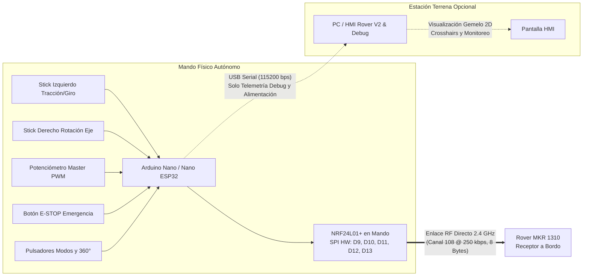

# GUÍA TÉCNICA Y ESQUEMÁTICO: MANDO JOYSTICK AUTÓNOMO CON NRF24L01

> **SUBSISTEMA DE TELEOPERACIÓN MANUAL AUTÓNOMO — ROVER LUNAR V2.0**  
> Documentación de diseño de hardware, conexionado de pines, cinemática embebida y telemetría de depuración para el mando de control remoto físico con Arduino Nano / Arduino Nano ESP32 y radio NRF24L01+ integrada.

---

## 1. Visión General y Filosofía de Diseño

El mando físico (**Remote Standalone Joystick Controller**) es una estación de control manual **100% autónoma**:
* **Operación de Campo (Sin PC):** El microcontrolador (Arduino Nano / Nano ESP32) adquiere las señales de los sticks y pulsadores, resuelve la cinemática de dirección en tiempo real y transmite directamente la trama binaria de radiocontrol mediante su módulo **NRF24L01+** hacia el Rover (Arduino MKR 1310).
* **Operación de Depuración (Con PC opcional):** Al conectar el mando a una PC por cable USB, el mando envía simultáneamente telemetría de diagnóstico continua en formato serie (115200 baudios, ~28 Hz). La interfaz HMI en la computadora funciona como estación terrena pasiva para visualizar el gemelo digital 2D, monitorear los niveles analógicos y planificar calibraciones.

### Diagrama de Arquitectura del Sistema:


---

## 2. Lista de Componentes y Materiales (BOM)

| Componente | Cantidad | Especificaciones / Modelo | Función en el Mando |
|---|---|---|---|
| **Microcontrolador** | 1 | Arduino Nano V3.0 (ATmega328P) o Arduino Nano ESP32 | Procesamiento cinemático, adquisición ADC y control de radio |
| **Módulo de Radio RF**| 1 | NRF24L01+ con antena integrada o con conector SMA (PA+LNA)| Transmisión inalámbrica de ultra baja latencia a 2.4 GHz |
| **Capacitor de Radio** | 1 | Electrolítico 10 µF a 100 µF (16V o superior) | **OBLIGATORIO** soldado directo entre VCC (3.3V) y GND del NRF24 |
| **Thumbsticks Analógicos** | 2 | Módulo 2 Ejes tipo KY-023 / PS2 (potenciómetros 10 kΩ + SW) | Control de avance/reversa, giro Ackermann, strafe y pivot turn |
| **Potenciómetro Maestro** | 1 | Potenciómetro rotativo lineal 10 kΩ (B10K) | Ajuste directo del techo de potencia PWM (0 a 255) |
| **Pulsador de Emergencia** | 1 | Botón pulsador rojo tipo hongo o momentáneo NA | Parada de emergencia física instantánea (E-STOP) |
| **Pulsador / Switch 360°** | 1 | Pulsador momentáneo o palanca biestable SPST | Conmutador entre Servos Estándar [10°-170°] y 360° |
| **Pulsadores de Macros** | 2 | Pulsadores táctiles momentáneos (6x6 mm o 12x12 mm) | Disparo rápido de giro sobre su eje (Izq Q / Der E) |
| **LED de Estado** | 1 | LED verde o cian de 3 mm o 5 mm + resistencia 330 Ω | Indicador de latido y paquete transmitido con éxito |

---

## 3. Pinout y Conexionado Eléctrico Completo

> [!CAUTION]
> **REGLA CRÍTICA DE ALIMENTACIÓN DEL NRF24L01:**  
> El módulo NRF24L01 **debe alimentarse estrictamente con la salida de 3.3V** del Arduino Nano. Conectarlo a 5V quema la radio en el acto.  
> Es imprescindible colocar el **capacitor electrolítico (10 a 100 µF)** directamente entre sus pines VCC y GND.

### 3.1. Conexión del Módulo de Radiofrecuencia NRF24L01+
| Pin NRF24L01 | Pin Arduino Nano | Función / Detalle |
|---|---|---|
| **VCC** | **3.3V** | Alimentación regulada 3.3V (con capacitor 10-100µF a GND) |
| **GND** | **GND** | Tierra común |
| **CE** | **Pin Digital 9** | Control de habilitación de radio (Chip Enable) |
| **CSN** | **Pin Digital 10** | Chip Select SPI |
| **MOSI** | **Pin Digital 11** | Bus SPI Hardware (Master Out Slave In) |
| **MISO** | **Pin Digital 12** | Bus SPI Hardware (Master In Slave Out) |
| **SCK** | **Pin Digital 13** | Bus SPI Hardware (Serial Clock) |

---

### 3.2. Entradas Analógicas (Sticks y Potenciómetro)
Todos los potenciómetros se alimentan con **5V** (o **3.3V** en Nano ESP32) y **GND**.

| Componente | Pin del Módulo | Pin Arduino Nano | Función Cinemática |
|---|---|---|---|
| **Stick 1 (Izquierdo)** | VRX | **A0** | Eje X: Giro lateral proporcional o Strafe Cangrejo |
| **Stick 1 (Izquierdo)** | VRY | **A1** | Eje Y: Avance y Retroceso longitudinal |
| **Stick 2 (Derecho)** | VRX | **A2** | Eje X: Rotación sobre su propio eje (Point Turn) |
| **Stick 2 (Derecho)** | VRY | **A3** | Eje Y: Control auxiliar (Cámara / Pitch) |
| **Potenciómetro Maestro**| Central | **A4** | Potencia Master global (0 a 255 PWM) |

---

### 3.3. Entradas Digitales (Configuradas con `INPUT_PULLUP`)
El microcontrolador activa las resistencias pull-up internas. Cada pulsador se conecta entre el pin indicado y **GND**:

| Componente | Pin Arduino Nano | Estado Normal | Al Presionar | Acción |
|---|---|---|---|---|
| **SW Stick 1 (Pulsador Izq)** | **Pin Digital 2** | `HIGH` (VCC) | `LOW` (GND) | Alterna Modo: Ackermann ⟷ Cangrejo |
| **SW Stick 2 (Pulsador Der)** | **Pin Digital 3** | `HIGH` (VCC) | `LOW` (GND) | Recentrado inmediato de servos a 90° |
| **Pulsador E-STOP** | **Pin Digital 4** | `HIGH` (VCC) | `LOW` (GND) | Parada de emergencia (corta tracción a 0) |
| **Switch / Pulsador 360°** | **Pin Digital 5** | `HIGH` (VCC) | `LOW` (GND) | Alterna rango: Estándar (10°-170°) ⟷ 360° |
| **Pulsador Macro Izq (↺)** | **Pin Digital 6** | `HIGH` (VCC) | `LOW` (GND) | Dispara rotación sobre eje antihoraria |
| **Pulsador Macro Der (↻)** | **Pin Digital 7** | `HIGH` (VCC) | `LOW` (GND) | Dispara rotación sobre eje horaria |
| **LED de Estado** | **Pin Digital 8** | Salida | Destello | Parpadea con cada transmisión RF exitosa |

---

## 4. Esquemático de Conexión del Mando

```text
                               +---------------------------------------+
                               |        ARDUINO NANO / NANO ESP32      |
                               +---------------------------------------+
                               |                                       |
  [ +3.3V ] o------------------| 3.3V           (Capacitor 10-100µF)   |
  [ GND   ] o------------------| GND             +--||--+              |
                               |                 |      |              |
                               |             +---+------+---+          |
                               |             |   NRF24L01+  |          |
                               | D9  ------->| CE           |          |
                               | D10 ------->| CSN          |          |
                               | D11 ------->| MOSI         |          |
                               | D12 <-------| MISO         |          |
                               | D13 ------->| SCK          |          |
                               |             +--------------+          |
                               |                                       |
  [ +5V / +3.3V ] o------------| 5V / VCC                              |
                               |   |---> VCC Stick 1, Stick 2, Pot 10K |
                               |                                       |
                               | A0 <--- VRX Stick 1 (Izquierdo)       |
                               | A1 <--- VRY Stick 1 (Izquierdo)       |
                               | A2 <--- VRX Stick 2 (Derecho)         |
                               | A3 <--- VRY Stick 2 (Derecho)         |
                               | A4 <--- Cursor Potenciómetro Maestro  |
                               |                                       |
  [ GND   ] o------------------| GND                                   |
                               |   |---> GND Stick 1, Stick 2, Pot 10K |
                               |   |---> Terminal común pulsadores     |
                               |                                       |
                               | D2 <--- SW Stick 1 (Pulsador Modo)    |
                               | D3 <--- SW Stick 2 (Pulsador 90°)     |
                               | D4 <--- Botón E-STOP Rojo             |
                               | D5 <--- Switch Modo Servos 360°       |
                               | D6 <--- Pulsador Macro Eje Izq (↺)    |
                               | D7 <--- Pulsador Macro Eje Der (↻)    |
                               |                                       |
                               | D8 --->[ Resistor 330Ω ]--->[LED]--->GND
                               +---------------------------------------+
```

---

## 5. Protocolo de Comunicación RF y Trama Serie de Depuración

### 5.1. Trama Inalámbrica Directa al Rover (8 Bytes Binarios)
El mando envía cada **$35\text{ ms}$** (~28 Hz) la estructura binaria unificada que el receptor MKR 1310 ya reconoce:

```cpp
struct __attribute__((packed)) PaqueteControl {
  int16_t traccion_izq;  // -255 a 255 (Lado Izquierdo)
  int16_t traccion_der;  // -255 a 255 (Lado Derecho)
  uint8_t angulo_s1;     // S1: Delantero Izquierdo
  uint8_t angulo_s2;     // S2: Delantero Derecho
  uint8_t angulo_s3;     // S3: Trasero Izquierdo
  uint8_t angulo_s4;     // S4: Trasero Derecho
};
```
* **Canal:** `108` (2.508 GHz).
* **Data Rate:** `RF24_250KBPS`.
* **Potencia:** `RF24_PA_MAX`.
* **AutoAck:** Desactivado (`false`) para streaming continuo en tiempo real.

### 5.2. Telemetría de Depuración Serie (Mando ➔ PC / HMI)
Si se conecta por USB a la PC, el mando transmite por Serial a **115200 baudios**:

```text
JOY:s1_x,s1_y,s2_x,s2_y,master_pwm,sw1,sw2,estop,s360,piv_izq,piv_der,tx_ok\n
```
Esto permite a la HMI en pantalla reproducir los crosshairs de los sticks, leer el nivel de batería/potenciómetro y verificar la tasa de transmisión sin interferir con la conducción del Rover.

---

## 6. Opciones de Alimentación para Uso en Terreno

1. **Power Bank USB:** Conectado directamente al conector USB del Arduino Nano. Proporciona 5V regulados y limpios para horas de autonomía.
2. **Batería de 9V (o 2 celdas 18650 en serie ~7.4V - 8.4V):**
   * Polo Positivo (+) al pin **`VIN`** del Arduino Nano.
   * Polo Negativo (-) al pin **`GND`**.
   * El regulador interno del Nano reduce el voltaje a 5V y 3.3V para la electrónica.
