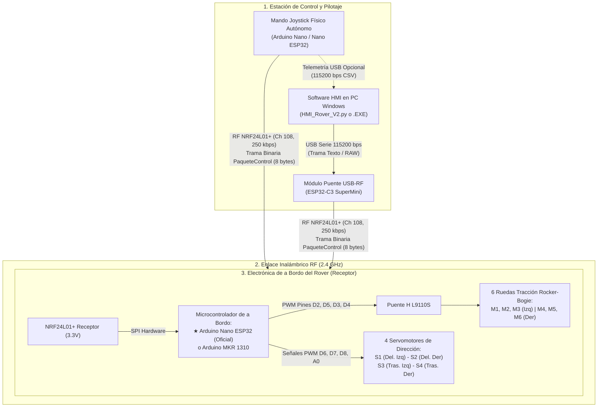

# 🛰️ ROVER LUNAR V2.0 — PLATAFORMA ROBÓTICA ROCKER-BOGIE

> **Repositorio Oficial de Firmware, Control y Software de Estación Terrena (HMI)**  
> Desarrollado para la misión análoga de exploración lunar y aplicaciones industriales terrestres en minería subterránea e inspección en espacios confinados.  
> **Equipo CEPIT:** Joaquín, Lucas, Lucio, Sebastián, Emir, Benjamín, Keila y Ainsworth.

---

## 📌 Tabla de Contenidos
1. [Visión General del Proyecto](#-visión-general-del-proyecto)
2. [Arquitectura de Integración del Sistema](#-arquitectura-de-integración-del-sistema)
3. [Catálogo de Firmwares (.ino) y Microcontroladores](#-catálogo-de-firmwares-ino-y-microcontroladores)
   - [Mando de Radiocontrol Físico Autónomo](#1-mando-de-radiocontrol-físico-autónomo-emisor)
   - [Módulo Transmisor PC / Puente RF](#2-módulo-transmisor-pc--puente-serie-rf-emisor)
   - [Electrónica de a Bordo del Rover (Última Versión Oficial)](#3-electrónica-de-a-bordo-del-rover-receptor---versión-oficial)
   - [Electrónica de a Bordo del Rover (Versión Previa MKR)](#4-electrónica-de-a-bordo-del-rover-receptor---versión-previa-mkr)
4. [Guía Paso a Paso para Instalar y Flashear cada .ino](#-guía-paso-a-paso-para-instalar-y-flashear-cada-ino)
5. [Software HMI de Estación Terrena (Windows)](#-software-hmi-de-estación-terrena-windows)
6. [Reglas Críticas de Seguridad y Lecciones de Hardware](#-reglas-críticas-de-seguridad-y-lecciones-de-hardware)
7. [Estructura del Repositorio](#-estructura-del-repositorio)
8. [Documentación Técnica Detallada](#-documentación-técnica-detallada)

---

## 🌌 Visión General del Proyecto

El **Rover Lunar V2.0** es un vehículo robótico de exploración móvil diseñado para superar terrenos altamente agrestes, pendientes de hasta 20° y regolito simulado mediante una suspensión mecánica de tipo **Rocker-Bogie** con:
* **Tracción 6x6:** Seis motores de corriente continua con caja reductora coordinados mediante un puente H doble L9110S.
* **Dirección 4WS (Four-Wheel Steering):** Cuatro servomotores independientes ubicados en las esquinas para maniobras de precisión (geometría Ackermann, giro sobre el propio eje en 360° y desplazamiento diagonal tipo cangrejo).
* **Enlace de Radiofrecuencia de Alta Confiabilidad:** Transmisión a 2.4 GHz mediante módulos NRF24L01+ configurados en el canal 108 (2.508 GHz, inmune a interferencias de Wi-Fi doméstico) con paquetes binarios compactos de 6 y 8 bytes.

---

## 🏗️ Arquitectura de Integración del Sistema



---

## 💻 Catálogo de Firmwares (.ino) y Microcontroladores

A continuación se detalla cada código fuente del proyecto, su ubicación exacta, su función y **qué microcontrolador físico está previsto para su funcionamiento**:

| Archivo `.ino` | Carpeta en el Repositorio | Microcontrolador Previsto (Última Versión) | Rol en el Sistema |
|---|---|---|---|
| **`Ejecutor_ArduinoNano_ESP32.ino`** | [`Firmware_y_Control/Ejecutor/Ejecutor_ArduinoNano_ESP32/`](file:///mnt/c/Users/joaqu/Downloads/hmi_rover_cepit/Firmware_y_Control/Ejecutor/Ejecutor_ArduinoNano_ESP32) | ⭐ **Arduino Nano ESP32** (ESP32-S3 a 3.3V) | **Receptor Oficial del Rover:** 6 motores + 4 servos independientes. |
| **`Joystick_Arduino_Nano.ino`** | [`Firmware_y_Control/Control/Joystick_Arduino_Nano/`](file:///mnt/c/Users/joaqu/Downloads/hmi_rover_cepit/Firmware_y_Control/Control/Joystick_Arduino_Nano) | **Arduino Nano Clásico (ATmega328P)** o **Arduino Nano ESP32** | **Mando Joystick Físico Autónomo:** Control inalámbrico sin PC. |
| **`Control_ESP32_C3_Optimizado.ino`** | [`Firmware_y_Control/Control/Control_ESP32_C3_Optimizado/`](file:///mnt/c/Users/joaqu/Downloads/hmi_rover_cepit/Firmware_y_Control/Control/Control_ESP32_C3_Optimizado) | **ESP32-C3 SuperMini** / **LOLIN C3 Mini** (RISC-V a 3.3V) | **Transmisor PC:** Puente USB Serial a Radiofrecuencia RF24. |
| **`Control_ESP32_C3_Debug.ino`** | [`Firmware_y_Control/Control/Control_ESP32_C3_Debug/`](file:///mnt/c/Users/joaqu/Downloads/hmi_rover_cepit/Firmware_y_Control/Control/Control_ESP32_C3_Debug) | **ESP32-C3 SuperMini** / **LOLIN C3 Mini** | **Transmisor Modo Debug:** Reporte de volcado HEX y métricas de tasa. |
| **`Ejecutor_ArduinoMKR_Optimizado.ino`** | [`Firmware_y_Control/Ejecutor/Ejecutor_ArduinoMKR_Optimizado/`](file:///mnt/c/Users/joaqu/Downloads/hmi_rover_cepit/Firmware_y_Control/Ejecutor/Ejecutor_ArduinoMKR_Optimizado) | **Arduino MKR 1310** (SAMD21 ARM Cortex-M0+ a 3.3V) | **Receptor Alternativo:** Versión previa con drenaje rápido y failsafe. |
| **`Ejecutor_ArduinoMKR_Debug.ino`** | [`Firmware_y_Control/Ejecutor/Ejecutor_ArduinoMKR_Debug/`](file:///mnt/c/Users/joaqu/Downloads/hmi_rover_cepit/Firmware_y_Control/Ejecutor/Ejecutor_ArduinoMKR_Debug) | **Arduino MKR 1310** (SAMD21 ARM Cortex-M0+ a 3.3V) | **Receptor Modo Debug:** Validación cruzada TX/RX y telemetría de retorno. |

---

## 🛠️ Guía Paso a Paso para Instalar y Flashear cada .ino

### Preparación del Entorno (Arduino IDE 2.x)
1. Descargá e instalá **[Arduino IDE 2.x](https://www.arduino.cc/en/software)**.
2. Abrí el gestor de librerías (`Ctrl + Shift + I`) e instalá:
   * **`RF24`** (por *TMRh20*).
   * **`ESP32Servo`** (por *Kevin Harrington* - obligatoria si usás ESP32).
   * **`Servo`** (librería estándar integrada para Arduino clásico y SAMD).

---

### 1. Flashear el Receptor Oficial del Rover: `Ejecutor_ArduinoNano_ESP32.ino`
* **Ubicación:** `Firmware_y_Control/Ejecutor/Ejecutor_ArduinoNano_ESP32/Ejecutor_ArduinoNano_ESP32.ino`
* **Microcontrolador:** **Arduino Nano ESP32**
1. En Arduino IDE, andá a **Boards Manager** (`Ctrl + Shift + B`) e instalá el paquete **`Arduino ESP32 Boards`**.
2. Seleccioná la placa: **`Arduino Nano ESP32`**.
3. En *Pin Numbering*, dejá la opción predeterminada: **`By Arduino pin (default)`**.
4. Conectá el cable USB-C al Arduino Nano ESP32 y seleccioná el puerto COM asignado.
5. Hacé clic en **Subir (Upload)**.
> *Esquemático completo de conexiones:* Ver [ESQUEMATICO_NANO_ESP32.md](file:///mnt/c/Users/joaqu/Downloads/hmi_rover_cepit/ESQUEMATICO_NANO_ESP32.md).

---

### 2. Flashear el Mando Joystick Autónomo: `Joystick_Arduino_Nano.ino`
* **Ubicación:** `Firmware_y_Control/Control/Joystick_Arduino_Nano/Joystick_Arduino_Nano.ino`
* **Microcontrolador:** **Arduino Nano Clásico (ATmega328P)** o **Arduino Nano ESP32**
1. Si usás el Arduino Nano clásico azul:
   * Seleccioná la placa: **`Arduino Nano`**.
   * En *Procesador*, elegí **`ATmega328P`** (si da error de sincronización, cambiá a **`ATmega328P (Old Bootloader)`**).
2. Si usás el Arduino Nano ESP32 negro:
   * Seleccioná la placa: **`Arduino Nano ESP32`**.
3. Verificá que la librería `RF24` esté instalada.
4. Conectá el cable USB, seleccioná el puerto COM y hacé clic en **Subir**.
> *Guía de armado de hardware y cableado:* Ver [GUIA_JOYSTICK_HARDWARE.md](file:///mnt/c/Users/joaqu/Downloads/hmi_rover_cepit/GUIA_JOYSTICK_HARDWARE.md).

---

### 3. Flashear el Módulo Transmisor PC: `Control_ESP32_C3_Optimizado.ino`
* **Ubicación:** `Firmware_y_Control/Control/Control_ESP32_C3_Optimizado/Control_ESP32_C3_Optimizado.ino`
* **Microcontrolador:** **ESP32-C3 SuperMini** / **LOLIN C3 Mini**
1. En **Boards Manager**, instalá el paquete **`esp32`** de *Espressif Systems*.
2. Seleccioná la placa: **`ESP32C3 Dev Module`** o **`LOLIN C3 Mini`**.
3. Ajustes de compilación recomendados en el menú *Tools*:
   * *USB CDC On Boot:* **`Enabled`** (fundamental para el puerto serie por USB nativo).
   * *Flash Frequency:* **`80MHz`**.
4. Conectá el cable USB-C, seleccioná el COM y subí el código.

---

### 4. Flashear el Receptor Previo en Arduino MKR: `Ejecutor_ArduinoMKR_Optimizado.ino`
* **Ubicación:** `Firmware_y_Control/Ejecutor/Ejecutor_ArduinoMKR_Optimizado/Ejecutor_ArduinoMKR_Optimizado.ino`
* **Microcontrolador:** **Arduino MKR 1310** (o MKR WiFi 1010)
1. En **Boards Manager**, instalá el paquete **`Arduino SAMD Boards (32-bits ARM Cortex-M0+)`**.
2. Seleccioná la placa: **`Arduino MKR WAN 1310`**.
3. Conectá el cable micro-USB, seleccioná el COM y subí el código.
> *Esquemático completo de conexiones:* Ver [ESQUEMATICO_MKR1310.md](file:///mnt/c/Users/joaqu/Downloads/hmi_rover_cepit/ESQUEMATICO_MKR1310.md).

---

## 🖥️ Software HMI de Estación Terrena (Windows)

Para operar el Rover desde la computadora, el repositorio incluye dos interfaces gráficas desarrolladas en Python con Tkinter, completamente libres de dependencias complejas y con detección inteligente de puertos COM:

* **[`HMI_Rover_V2.py`](file:///mnt/c/Users/joaqu/Downloads/hmi_rover_cepit/Firmware_y_Control/Interfaz/HMI_Rover_V2.py):** Interfaz principal de pilotaje con telemetría en tiempo real, digital twin 2D, sliders de calibración independiente de potencia (trims 0% a 150%) y selector de modos (Ackermann, Cangrejo y Giro 360°).
* **[`HMI_Rover_Debug.py`](file:///mnt/c/Users/joaqu/Downloads/hmi_rover_cepit/Firmware_y_Control/Interfaz/HMI_Rover_Debug.py):** Herramienta de diagnóstico de laboratorio con validación cruzada TX <-> RX en vivo, cálculo de latencia en milisegundos y registro de paquetes FIFO.

### ¿Cómo correr la HMI en Windows sin complicaciones?
Elegí el método que prefieras:
1. **Ejecutable Directo (Sin instalar Python ni nada):**  
   Hacé doble clic en [`Compilar_HMI_a_EXE.bat`](file:///mnt/c/Users/joaqu/Downloads/hmi_rover_cepit/Compilar_HMI_a_EXE.bat) para generar tu archivo **`HMI_Rover_Lunar_V2.exe`**. Luego, cualquier compañero solo tiene que hacer doble clic en el `.exe`.
2. **Lanzador Automático:**  
   Hacé doble clic en [`Lanzar_HMI_Rover.bat`](file:///mnt/c/Users/joaqu/Downloads/hmi_rover_cepit/Lanzar_HMI_Rover.bat). Si no tenés la librería `pyserial`, el script la detecta y la instala automáticamente en 2 segundos.

> *Manual de usuario en 1 minuto:* Consultá [`GUIA_RAPIDA_EQUIPO.md`](file:///mnt/c/Users/joaqu/Downloads/hmi_rover_cepit/GUIA_RAPIDA_EQUIPO.md).

---

## ⚠️ Reglas Críticas de Seguridad y Lecciones de Hardware

> [!CAUTION]
> **1. ALIMENTACIÓN DEL NRF24L01: NUNCA CONECTAR A 5V**  
> El módulo de radio tolera 5V en sus líneas lógicas SPI, pero su pin **VCC debe recibir estrictamente 3.3V**. Conectarlo a 5V destruye la radio de inmediato.

> [!IMPORTANT]
> **2. CAPACITOR ELECTROLÍTICO OBLIGATORIO (10 µF a 100 µF)**  
> Es mandatorio soldar un capacitor electrolítico directamente entre los pines **VCC y GND del NRF24L01+**. Previene caídas bruscas de tensión durante picos de transmisión y elimina la pérdida aleatoria de paquetes.

> [!WARNING]
> **3. REGULACIÓN PARA SERVOMOTORES (PROHIBIDO LM7805)**  
> Los 4 servomotores deben ser alimentados **únicamente mediante un regulador Step-Down conmutado (Buck) ajustado a 5V - 6V** (con masa común unida al microcontrolador). Nunca alimentar servos desde el pin 3.3V ni 5V del microcontrolador.

> [!IMPORTANT]
> **4. LÍMITES ANGULARES POR SOFTWARE ([10°, 170°])**  
> Para evitar trabas mecánicas y rotura de la piñonería de los servomotores, ningún comando de software solicita valores por fuera del rango seguro [10°, 170°].

> [!NOTE]
> **5. WATCHDOG FAILSAFE DE EMERGENCIA (1000 ms)**  
> Si el receptor de a bordo deja de recibir tramas de radio por más de 1 segundo, la rutina de seguridad interrumpe automáticamente la señal PWM y detiene los 6 motores a 0 de forma preventiva.

---

## 📂 Estructura del Repositorio

```text
hmi_rover_cepit/
├── README.md                                # Este documento principal de referencia y guía de uso
├── AGENTS.md                                # Contexto técnico exhaustivo para desarrolladores e IA
├── GUIA_RAPIDA_EQUIPO.md                    # Manual de 1 minuto para el equipo (100% Windows)
├── ESQUEMATICO_NANO_ESP32.md                # Esquemático oficial de a bordo (Arduino Nano ESP32)
├── ESQUEMATICO_MKR1310.md                   # Esquemático de conexiones previo (Arduino MKR 1310)
├── GUIA_JOYSTICK_HARDWARE.md                # Esquemático y cableado del Mando Joystick físico
├── EVALUACION_TECNICA_MICROPYTHON_ARDUINO_Q.md # Análisis de MicroPython y evaluación de Arduino UNO Q
├── Compilar_HMI_a_EXE.bat                   # Compilador de 1 clic a ejecutable HMI_Rover_Lunar_V2.exe
├── Lanzar_HMI_Rover.bat                     # Lanzador Windows inteligente con auto-instalación
├── Lanzar_HMI_Debug.bat                     # Lanzador Windows modo depuración y diagnóstico
├── Subir_Cambios.bat                        # Sincronizador de 1 clic con GitHub
├── WindowsFormsApp4/                        # Interfaz gráfica de telemetría previa en C# (.NET)
├── WindowsFormsApp4.slnx                    # Solución de Visual Studio
└── Firmware_y_Control/                      # Firmware de microcontroladores y software HMI
    ├── Contexto actual.docx                 # Documento técnico original del equipo
    ├── Codigo_MKR_28-8/                     # Código de referencia preliminar para MKR
    ├── Control/                             # Firmwares para el Mando y Módulo Transmisor
    │   ├── Joystick_Arduino_Nano/           # Firmware Mando Joystick físico autónomo (Nano / Nano ESP32)
    │   ├── Control_ESP32_C3_Optimizado/     # Firmware Transmisor PC optimizado (ESP32-C3)
    │   ├── Control_ESP32_C3_Debug/          # Firmware Transmisor PC modo DEBUG con volcado HEX
    │   ├── Control_LOLIN-C3-MINI/           # Firmware base para placa LOLIN C3 Mini
    │   ├── Control_LOLIN-C3-MINI-v0.2/
    │   └── Control_LOLIN_C3_MINI-v0.1/
    ├── Ejecutor/                            # Firmwares para el módulo Receptor del Rover
    │   ├── Ejecutor_ArduinoNano_ESP32/      # Firmware oficial del Rover (Arduino Nano ESP32 6x6 + 4WS)
    │   ├── Ejecutor_ArduinoMKR_Optimizado/  # Firmware receptor optimizado para Arduino MKR 1310
    │   ├── Ejecutor_ArduinoMKR_Debug/       # Firmware receptor modo DEBUG con reporte FIFO y watchdog
    │   ├── Ejecutor_ArduinoMKR/             # Firmware base para MKR
    │   └── Ejecutor_ArduinoMKR-v0.1/
    ├── Interfaz/                            # Software HMI de Estación Terrena en Python
    │   ├── HMI_Rover_V2.py                  # Interfaz principal de control y visualización 2D
    │   ├── HMI_Rover_Debug.py               # Herramienta de depuración y validación cruzada TX/RX
    │   ├── Interfaz-Rover-29-8-v2.py
    │   ├── Interfaz-Rover-29-8-v3.py
    │   └── Interfaz-Rover_29-8.py
    └── Test_RF/                             # Pruebas unitarias de radiofrecuencia NRF24L01
        ├── Test_RF_Transmisor_ESP32/
        └── Test_RF_Receptor_MKR/
```

---

## 📚 Documentación Técnica Detallada

* Para profundizar en los detalles de conexionado pin a pin y pines libres del receptor: [`ESQUEMATICO_NANO_ESP32.md`](file:///mnt/c/Users/joaqu/Downloads/hmi_rover_cepit/ESQUEMATICO_NANO_ESP32.md).
* Para armar el mando físico con joysticks y potenciómetro: [`GUIA_JOYSTICK_HARDWARE.md`](file:///mnt/c/Users/joaqu/Downloads/hmi_rover_cepit/GUIA_JOYSTICK_HARDWARE.md).
* Para conocer las directrices completas de desarrollo y arquitectura de software: [`AGENTS.md`](file:///mnt/c/Users/joaqu/Downloads/hmi_rover_cepit/AGENTS.md).
* Para evaluar el análisis de MicroPython y la futura plataforma Arduino UNO Q: [`EVALUACION_TECNICA_MICROPYTHON_ARDUINO_Q.md`](file:///mnt/c/Users/joaqu/Downloads/hmi_rover_cepit/EVALUACION_TECNICA_MICROPYTHON_ARDUINO_Q.md).
