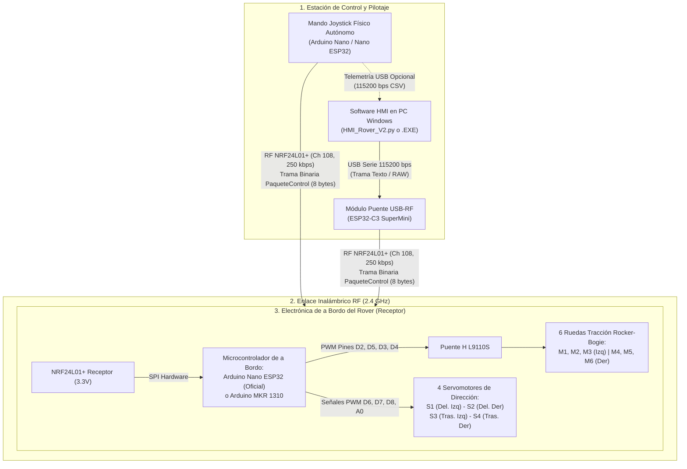

# ROVER LUNAR V2.0 — PLATAFORMA ROBOTICA ROCKER-BOGIE

> **Repositorio Oficial de Firmware, Control y Software de Estacion Terrena (HMI)**  
> Desarrollado para la mision analoga de exploracion lunar y aplicaciones industriales terrestres en mineria subterranea e inspeccion en espacios confinados.  
> **Equipo CEPIT:** Joaquin, Lucas, Lucio, Sebastian, Emir, Benjamin, Keila y Ainsworth.

---

## Tabla de Contenidos
1. [Vision General del Proyecto](#vision-general-del-proyecto)
2. [Arquitectura de Integracion del Sistema](#arquitectura-de-integracion-del-sistema)
3. [Catalogo de Firmwares (.ino) y Microcontroladores](#catalogo-de-firmwares-ino-y-microcontroladores)
   - [Mando de Radiocontrol Fisico Autonomo](#1-mando-de-radiocontrol-fisico-autonomo-emisor)
   - [Modulo Transmisor PC / Puente RF](#2-modulo-transmisor-pc--puente-serie-rf-emisor)
   - [Electronica de a Bordo del Rover (Ultima Version Oficial)](#3-electronica-de-a-bordo-del-rover-receptor---version-oficial)
   - [Electronica de a Bordo del Rover (Version Previa MKR)](#4-electronica-de-a-bordo-del-rover-receptor---version-previa-mkr)
4. [Guia Paso a Paso para Instalar y Flashear cada .ino](#guia-paso-a-paso-para-instalar-y-flashear-cada-ino)
5. [Software HMI de Estacion Terrena (Windows)](#software-hmi-de-estacion-terrena-windows)
6. [Reglas Criticas de Seguridad y Lecciones de Hardware](#reglas-criticas-de-seguridad-y-lecciones-de-hardware)
7. [Estructura del Repositorio](#estructura-del-repositorio)
8. [Documentacion Tecnica Detallada](#documentacion-tecnica-detallada)

---

## Vision General del Proyecto

El **Rover Lunar V2.0** es un vehículo robótico de exploración móvil diseñado para superar terrenos altamente agrestes, pendientes de hasta 20° y regolito simulado mediante una suspensión mecánica de tipo **Rocker-Bogie** con:
* **Tracción 6x6:** Seis motores de corriente continua con caja reductora coordinados mediante un puente H doble L9110S.
* **Dirección 4WS (Four-Wheel Steering):** Cuatro servomotores independientes ubicados en las esquinas para maniobras de precisión (geometría Ackermann, giro sobre el propio eje en 360° y desplazamiento diagonal tipo cangrejo).
* **Enlace de Radiofrecuencia de Alta Confiabilidad:** Transmisión a 2.4 GHz mediante módulos NRF24L01+ configurados en el canal 108 (2.508 GHz, inmune a interferencias de Wi-Fi doméstico) con paquetes binarios compactos de 6 y 8 bytes.

---

## Arquitectura de Integración del Sistema


```mermaid
graph TD
    subgraph ESTACION_PILOTAJE ["1. Estación de Control y Pilotaje"]
        MANDO["Mando Joystick Físico Autónomo\n(Arduino Nano / Nano ESP32)"]
        PC_HMI["Software HMI en PC Windows\n(HMI_Rover_V2.py o .EXE)"]
        ESP32_TX["Módulo Puente USB-RF\n(ESP32-C3 SuperMini)"]
        
        PC_HMI -->|"USB Serie 115200 bps\n(Trama Texto / RAW)"| ESP32_TX
        MANDO -.->|"Telemetría USB Opcional\n(115200 bps CSV)"| PC_HMI
    end

    subgraph ENLACE_RF ["2. Enlace Inalámbrico RF (2.4 GHz)"]
        MANDO -->|"RF NRF24L01+ (Ch 108, 250 kbps)\nTrama Binaria PaqueteControl (8 bytes)"| ROVER
        ESP32_TX -->|"RF NRF24L01+ (Ch 108, 250 kbps)\nTrama Binaria PaqueteControl (8 bytes)"| ROVER
    end

    subgraph ROVER ["3. Electrónica de a Bordo del Rover (Receptor)"]
        MCU_ROVER["Microcontrolador de a Bordo:\nArduino Nano ESP32 (Oficial)\no Arduino MKR 1310"]
        RF_RX["NRF24L01+ Receptor (3.3V)"]
        HBRIDGE["Puente H L9110S"]
        SERVOS["4 Servomotores de Dirección:\nS1 (Del. Izq) - S2 (Del. Der)\nS3 (Tras. Izq) - S4 (Tras. Der)"]
        MOTORES["6 Ruedas Tracción Rocker-Bogie:\nM1, M2, M3 (Izq) | M4, M5, M6 (Der)"]

        RF_RX -->|"SPI Hardware"| MCU_ROVER
        MCU_ROVER -->|"PWM Pines D2, D5, D3, D4"| HBRIDGE
        HBRIDGE --> MOTORES
        MCU_ROVER -->|"Señales PWM D6, D7, D8, A0"| SERVOS
    end
```

---

## Catálogo de Firmwares (.ino) y Microcontroladores

A continuación se detalla cada código fuente del proyecto, su ubicación exacta, su función y **qué microcontrolador físico está previsto para su funcionamiento**:

| Archivo `.ino` | Carpeta en el Repositorio | Microcontrolador Previsto (Última Versión) | Rol en el Sistema |
|---|---|---|---|
| **`Ejecutor_ArduinoNano_ESP32.ino`** | [`01_Oficial/Receptor_Rover_NanoESP32/Ejecutor_ArduinoNano_ESP32/`](01_Oficial/Receptor_Rover_NanoESP32/Ejecutor_ArduinoNano_ESP32) | **Arduino Nano ESP32** (ESP32-S3 a 3.3V) [Oficial] | **Receptor Oficial del Rover:** 6 motores + 4 servos independientes. |
| **`Transmisor_ArduinoNano_ESP32.ino`** | [`02_Debug_y_Pruebas/Firmware_Debug/Transmisor_ArduinoNano_ESP32/`](02_Debug_y_Pruebas/Firmware_Debug/Transmisor_ArduinoNano_ESP32) | **Arduino Nano ESP32** (ESP32-S3 a 3.3V) [Oficial] | **Transmisor PC Oficial:** Puente USB-RF con handshake y LED RGB. |
| **`Joystick_Arduino_Nano.ino`** | [`01_Oficial/Mando_Joystick_Fisico/Joystick_Arduino_Nano/`](01_Oficial/Mando_Joystick_Fisico/Joystick_Arduino_Nano) | **Arduino Nano Clásico (ATmega328P)** o **Arduino Nano ESP32** | **Mando Joystick Físico Autónomo:** Control inalámbrico sin PC. |
| **`Control_ESP32_C3_Optimizado.ino`** | [`01_Oficial/Transmisor_PC_ESP32C3/Control_ESP32_C3_Optimizado/`](01_Oficial/Transmisor_PC_ESP32C3/Control_ESP32_C3_Optimizado) | **ESP32-C3 SuperMini** / **LOLIN C3 Mini** (RISC-V a 3.3V) | **Transmisor PC Alternativo:** Puente USB Serial a Radiofrecuencia RF24. |
| **`Control_ESP32_C3_Debug.ino`** | [`02_Debug_y_Pruebas/Firmware_Debug/Control_ESP32_C3_Debug/`](02_Debug_y_Pruebas/Firmware_Debug/Control_ESP32_C3_Debug) | **ESP32-C3 SuperMini** / **LOLIN C3 Mini** | **Transmisor Modo Debug:** Reporte de volcado HEX y métricas de tasa. |
| **`Ejecutor_ArduinoMKR_Optimizado.ino`** | [`01_Oficial/Receptor_Rover_MKR1310/Ejecutor_ArduinoMKR_Optimizado/`](01_Oficial/Receptor_Rover_MKR1310/Ejecutor_ArduinoMKR_Optimizado) | **Arduino MKR 1310** (SAMD21 ARM Cortex-M0+ a 3.3V) | **Receptor Alternativo:** Versión previa con drenaje rápido y failsafe. |
| **`Ejecutor_ArduinoMKR_Debug.ino`** | [`02_Debug_y_Pruebas/Firmware_Debug/Ejecutor_ArduinoMKR_Debug/`](02_Debug_y_Pruebas/Firmware_Debug/Ejecutor_ArduinoMKR_Debug) | **Arduino MKR 1310** (SAMD21 ARM Cortex-M0+ a 3.3V) | **Receptor Modo Debug:** Validación cruzada TX/RX y telemetría de retorno. |

---

## Guía Paso a Paso para Instalar y Flashear cada .ino

### Preparación del Entorno (Arduino IDE 2.x)
1. Descargá e instalá **[Arduino IDE 2.x](https://www.arduino.cc/en/software)**.
2. Abrí el gestor de librerías (`Ctrl + Shift + I`) e instalá:
   * **`RF24`** (por *TMRh20*).
   * **`ESP32Servo`** (por *Kevin Harrington* - obligatoria si usás ESP32).
   * **`Servo`** (librería estándar integrada para Arduino clásico y SAMD).

---

### 1. Flashear el Receptor Oficial del Rover: `Ejecutor_ArduinoNano_ESP32.ino`
* **Ubicación:** `01_Oficial/Receptor_Rover_NanoESP32/Ejecutor_ArduinoNano_ESP32/Ejecutor_ArduinoNano_ESP32.ino`
* **Microcontrolador:** **Arduino Nano ESP32**
1. En Arduino IDE, andá a **Boards Manager** (`Ctrl + Shift + B`) e instalá el paquete **`Arduino ESP32 Boards`**.
2. Seleccioná la placa: **`Arduino Nano ESP32`**.
3. En *Pin Numbering*, dejá la opción predeterminada: **`By Arduino pin (default)`**.
4. Conectá el cable USB-C al Arduino Nano ESP32 y seleccioná el puerto COM asignado.
5. Hacé clic en **Subir (Upload)**.
> *Esquemático completo de conexiones:* Ver [03_Documentacion_y_Guias/Esquematicos/ESQUEMATICO_NANO_ESP32.md](03_Documentacion_y_Guias/Esquematicos/ESQUEMATICO_NANO_ESP32.md).

---

### 2. Flashear el Mando Joystick Autónomo: `Joystick_Arduino_Nano.ino`
* **Ubicación:** `01_Oficial/Mando_Joystick_Fisico/Joystick_Arduino_Nano/Joystick_Arduino_Nano.ino`
* **Microcontrolador:** **Arduino Nano Clásico (ATmega328P)** o **Arduino Nano ESP32**
1. Si usás el Arduino Nano clásico azul:
   * Seleccioná la placa: **`Arduino Nano`**.
   * En *Procesador*, elegí **`ATmega328P`** (si da error de sincronización, cambiá a **`ATmega328P (Old Bootloader)`**).
2. Si usás el Arduino Nano ESP32 negro:
   * Seleccioná la placa: **`Arduino Nano ESP32`**.
3. Verificá que la librería `RF24` esté instalada.
4. Conectá el cable USB, seleccioná el puerto COM y hacé clic en **Subir**.
> *Guía de armado de hardware y cableado:* Ver [03_Documentacion_y_Guias/Guias/GUIA_JOYSTICK_HARDWARE.md](03_Documentacion_y_Guias/Guias/GUIA_JOYSTICK_HARDWARE.md).

---

### 3. Flashear el Módulo Transmisor PC: `Control_ESP32_C3_Optimizado.ino`
* **Ubicación:** `01_Oficial/Transmisor_PC_ESP32C3/Control_ESP32_C3_Optimizado/Control_ESP32_C3_Optimizado.ino`
* **Microcontrolador:** **ESP32-C3 SuperMini** / **LOLIN C3 Mini**
1. En **Boards Manager**, instalá el paquete **`esp32`** de *Espressif Systems*.
2. Seleccioná la placa: **`ESP32C3 Dev Module`** o **`LOLIN C3 Mini`**.
3. Ajustes de compilación recomendados en el menú *Tools*:
   * *USB CDC On Boot:* **`Enabled`** (fundamental para el puerto serie por USB nativo).
   * *Flash Frequency:* **`80MHz`**.
4. Conectá el cable USB-C, seleccioná el COM y subí el código.

---

### 4. Flashear el Receptor Previo en Arduino MKR: `Ejecutor_ArduinoMKR_Optimizado.ino`
* **Ubicación:** `01_Oficial/Receptor_Rover_MKR1310/Ejecutor_ArduinoMKR_Optimizado/Ejecutor_ArduinoMKR_Optimizado.ino`
* **Microcontrolador:** **Arduino MKR 1310** (o MKR WiFi 1010)
1. En **Boards Manager**, instalá el paquete **`Arduino SAMD Boards (32-bits ARM Cortex-M0+)`**.
2. Seleccioná la placa: **`Arduino MKR WAN 1310`**.
3. Conectá el cable micro-USB, seleccioná el COM y subí el código.
> *Esquemático completo de conexiones:* Ver [03_Documentacion_y_Guias/Esquematicos/ESQUEMATICO_MKR1310.md](03_Documentacion_y_Guias/Esquematicos/ESQUEMATICO_MKR1310.md).

---

## Software HMI de Estacion Terrena (Windows)

Para operar el Rover desde la computadora, el repositorio incluye interfaces graficas especializadas tanto en Python (Tkinter) como en Rust nativo (egui), libres de dependencias complejas y con deteccion inteligente de puertos COM:

* **[`HMI_Rover_V2.py`](01_Oficial/HMI/HMI_Rover_V2.py):** Interfaz principal de pilotaje en produccion con telemetria en tiempo real, digital twin 2D, sliders de calibracion independiente de potencia (trims 0% a 150%) y selector de modos (Ackermann, Cangrejo y Giro 360°).
* **[`HMI_Rover_Debug.py`](02_Debug_y_Pruebas/HMI_Debug/HMI_Rover_Debug.py):** Suite de depuracion avanzada y banco de pruebas con:
  - **Matriz de Perfiles de Hardware (`hardware_profiles.py`):** Autodeteccion pasiva por USB VID:PID y confirmacion activa por handshake (`IDENT` -> `ID:<PLACA>:<ROL>:<VERSION>`). Arduino Nano ESP32 como perfil oficial predeterminado.
  - **Motor de Flasheo en 1 Clic (`flasher_engine.py`):** Compilacion y subida asincrona de firmware para TX y RX directamente desde la GUI mediante `arduino-cli` o fallback a `esptool`.
  - **Flujo de Calibracion Pre-Despliegue:** Sincronizacion de trims y centros de servos con persistencia en memoria no volatil (`PERSIST_NVS`) y boton de liberacion segura de puerto para operacion en campo por bateria.
* **Stack Paralelo Nativo en Rust (`HMI-Lunar-Rover-Rust`):**
  - Aplicacion de escritorio nativa `hmi-gui` renderizada por GPU con `eframe` (egui).
  - Crate `protocol-rover` compatible con `#![no_std]` y paquetes binarios empaquetados de 6 bytes.
  - Firmwares embebidos en Rust para el transmisor y receptor (`firmware-tx-esp32` y `firmware-rx-esp32`).

### ¿Como correr la HMI en Windows sin complicaciones?
Elegi el metodo que prefieras:
1. **Ejecutable Directo (Sin instalar Python ni nada):**  
   Hace doble clic en [`Compilar_HMI_a_EXE.bat`](Compilar_HMI_a_EXE.bat) para generar tu archivo **`HMI_Rover_Lunar_V2.exe`**. Luego, cualquier companero solo tiene que hacer doble clic en el `.exe`.
2. **Lanzador Automatico de Produccion:**  
   Hace doble clic en [`Lanzar_HMI_Rover.bat`](Lanzar_HMI_Rover.bat). Si no tenes la libreria `pyserial`, el script la detecta y la instala automaticamente en 2 segundos.
3. **Lanzador de Modo Diagnostico y Flasheo:**  
   Hace doble clic en [`02_Debug_y_Pruebas/Lanzar_HMI_Debug.bat`](02_Debug_y_Pruebas/Lanzar_HMI_Debug.bat).
4. **Lanzador del Stack en Rust:**  
   Abrir terminal en `C:\Users\joaqu\Desktop\HMI-Lunar-Rover-Rust` y ejecutar `cargo run -p hmi-gui`.

> *Manual de usuario en 1 minuto:* Consulta [`03_Documentacion_y_Guias/Guias/GUIA_RAPIDA_EQUIPO.md`](03_Documentacion_y_Guias/Guias/GUIA_RAPIDA_EQUIPO.md).

---

## Reglas Criticas de Seguridad y Lecciones de Hardware

> [!CAUTION]
> **1. ALIMENTACIÓN DEL NRF24L01: NUNCA CONECTAR A 5V**  
> El módulo de radio tolera 5V en sus líneas lógicas SPI, pero su pin **VCC debe recibir estrictamente 3.3V**. Conectarlo a 5V destruye la radio de inmediato.

> [!IMPORTANT]
> **2. CAPACITOR ELECTROLÍTICO OBLIGATORIO (10 µF a 100 µF)**  
> Es mandatorio soldar un capacitor electrolítico directamente entre los pines **VCC y GND del NRF24L01+**. Previene caídas bruscas de tensión durante picos de transmisión y elimina la pérdida aleatoria de paquetes.

> [!WARNING]
> **3. REGULACIÓN PARA SERVOMOTORES (PROHIBIDO LM7805)**  
> Los 4 servomotores deben ser alimentados **únicamente mediante un regulador Step-Down conmutado (Buck) ajustado a 5V - 6V** (con masa común unida al microcontrolador). Nunca alimentar servos desde el pin 3.3V ni 5V del microcontrolador.

> [!IMPORTANT]
> **4. LÍMITES ANGULARES POR SOFTWARE ([10°, 170°])**  
> Para evitar trabas mecánicas y rotura de la piñonería de los servomotores, ningún comando de software solicita valores por fuera del rango seguro [10°, 170°].

> [!NOTE]
> **5. WATCHDOG FAILSAFE DE EMERGENCIA (1000 ms)**  
> Si el receptor de a bordo deja de recibir tramas de radio por más de 1 segundo, la rutina de seguridad interrumpe automáticamente la señal PWM y detiene los 6 motores a 0 de forma preventiva.

---

## Estructura del Repositorio

El repositorio se encuentra estrictamente organizado por módulos funcionales:

```text
HMI-Lunar-Rover/
│
├── 01_Oficial/                                # Firmwares e interfaz en produccion
│   ├── HMI/                                   # HMI_Rover_V2.py (GUI principal de pilotaje)
│   ├── Receptor_Rover_NanoESP32/              # Ejecutor_ArduinoNano_ESP32.ino (Receptor Oficial)
│   ├── Receptor_Rover_MKR1310/                # Ejecutor_ArduinoMKR_Optimizado.ino (Receptor previo)
│   ├── Transmisor_PC_ESP32C3/                 # Control_ESP32_C3_Optimizado.ino (Puente USB-RF)
│   └── Mando_Joystick_Fisico/                 # Joystick_Arduino_Nano.ino (Mando RC autonomo)
│
├── 02_Debug_y_Pruebas/                        # Herramientas de depuracion y laboratorio
│   ├── HMI_Debug/                             # HMI_Rover_Debug.py (Telemetria y validacion)
│   ├── Firmware_Debug/                        # Firmwares con volcado HEX y logs FIFO
│   ├── Test_RF_Unitarios/                     # Sketches de prueba de radiofrecuencia NRF24L01
│   └── Lanzar_HMI_Debug.bat                   # Acceso directo al modo diagnostico
│
├── 03_Documentacion_y_Guias/                  # Manuales y planos de conexionado
│   ├── Guias/                                 # GUIA_RAPIDA_EQUIPO, GUIA_JOYSTICK_HARDWARE, etc.
│   └── Esquematicos/                          # ESQUEMATICO_NANO_ESP32 y ESQUEMATICO_MKR1310
│
├── 04_Legacy_y_Versiones_Previas/             # Archivos historicos o de grupos anteriores
│   ├── WindowsFormsApp4/                      # Interfaz en C# / .NET del grupo anterior
│   ├── WindowsFormsApp4.slnx
│   ├── Firmwares_Historicos/                  # Codigos de referencia v0.1, v0.2, LOLIN, etc.
│   ├── Interfaces_Historicas/                 # Scripts Python preliminares
│   └── Documentos_Originales/                 # Contexto actual.docx original
│
├── Herramientas_Docker_Wine/                  # Simulacion de Windows limpio en contenedor
│   ├── Dockerfile.wine-test                   # Definicion del entorno reproducible
│   ├── run_simulation.sh                     # Runner de pruebas automatizadas
│   ├── Simular_en_Docker.bat                  # Lanzador Windows (1 clic)
│   └── Simular_en_Docker.sh                   # Lanzador Linux / WSL
│
│   ─── SOLO ARCHIVOS ESENCIALES EN LA RAIZ ───
├── README.md                                  # Guia principal del proyecto y catalogo
├── AGENTS.md                                  # Contexto tecnico para desarrolladores e IA
├── Lanzar_HMI_Rover.bat                       # Lanzador inteligente en Windows (1 clic)
├── Compilar_HMI_a_EXE.bat                     # Compilador de 1 clic a HMI_Rover_Lunar_V2.exe
├── Subir_Cambios.bat                          # Sincronizador rapido con GitHub
└── .gitignore                                 # Exclusiones de Git
```

---

## Documentacion Tecnica Detallada

* Para profundizar en los detalles de conexionado pin a pin y pines libres del receptor: [`03_Documentacion_y_Guias/Esquematicos/ESQUEMATICO_NANO_ESP32.md`](03_Documentacion_y_Guias/Esquematicos/ESQUEMATICO_NANO_ESP32.md).
* Para consultar el estudio de viabilidad y costos de LiDAR, camaras y mapeo 3D en Rust para cuevas: [`03_Documentacion_y_Guias/Guias/ESTUDIO_VIABILIDAD_MAPEO_LIDAR_CAMARA_RUST.md`](03_Documentacion_y_Guias/Guias/ESTUDIO_VIABILIDAD_MAPEO_LIDAR_CAMARA_RUST.md).
* Para armar el mando físico con joysticks y potenciómetro: [`03_Documentacion_y_Guias/Guias/GUIA_JOYSTICK_HARDWARE.md`](03_Documentacion_y_Guias/Guias/GUIA_JOYSTICK_HARDWARE.md).
* Para conocer las directrices completas de desarrollo y arquitectura de software: [`AGENTS.md`](AGENTS.md).
* Para evaluar el análisis de MicroPython y la futura plataforma Arduino UNO Q: [`03_Documentacion_y_Guias/Guias/EVALUACION_TECNICA_MICROPYTHON_ARDUINO_Q.md`](03_Documentacion_y_Guias/Guias/EVALUACION_TECNICA_MICROPYTHON_ARDUINO_Q.md).
* Para explorar el codigo y documentacion del stack paralelo nativo en Rust: [`C:\Users\joaqu\Desktop\HMI-Lunar-Rover-Rust`](../HMI-Lunar-Rover-Rust).

